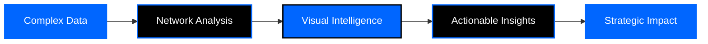

# 

<div align="center">

### Network Science × Creative Engineering × Intelligent Design

**We build systems that understand people — and empower them.**

[](https://www.peoplet.com)
[](mailto:info@peoplet.com)

</div>

---

## 🧬 We Are Hybrid

```diff
- Not an agency.
- Not a dev shop.
- Not a research lab.

+ Something in between — and beyond.
```

Our work lives where **data meets design**, where **structure becomes meaning**, and where people become **networks, patterns, and stories**.

---

## 🎯 What We Create

<table>
<tr>
<td width="50%" bgcolor="#0066ff">


**Mapping connections, revealing hidden pathways, identifying influence, and giving organizations a living, breathing view of themselves.**

```yaml
capabilities:
  - Network topology analysis
  - Influence mapping
  - Organizational intelligence
  - Relationship visualization
```

</td>
<td width="50%" bgcolor="#000000">


**Turning fragmented data into structure, insights, and smart decision layers.**

```yaml
capabilities:
  - Predictive modeling
  - Pattern recognition
  - Data transformation
  - Intelligence synthesis
```

</td>
</tr>
<tr>
<td width="50%" bgcolor="#1a1a1a">


**Systems built with precision and clarity using modern, battle-tested technologies.**

```yaml
capabilities:
  - Scalable architectures
  - Real-time systems
  - API development
  - Cloud infrastructure
```

</td>
<td width="50%" bgcolor="#0066ff">


**Identity, UX, interfaces, creative systems, and visual logic with purpose.**

```yaml
capabilities:
  - Product design
  - Brand systems
  - UI/UX strategy
  - Design systems
```

</td>
</tr>
</table>

---

## 🧭 Our Domains

<table>
<tr>
<td width="50%">

### 🕸️ 

```python
domains = {
    "structural_analysis": "Graph topology & patterns",
    "community_detection": "Clustering & grouping",
    "centrality_modeling": "Flow & influence metrics",
    "org_mapping": "Network intelligence",
    "forecasting": "Pattern prediction",
    "link_prediction": "Relationship scoring"
}
```

</td>
<td width="50%">

### 💻 

```javascript
const stack = {
  frontend: ["Next.js", "React", "TypeScript"],
  backend: ["Django", "DRF", "PostgreSQL"],
  graph: ["Neo4j"],
  realtime: ["Visualization engines"],
  apis: ["REST", "GraphQL"],
  infra: ["Docker"]
}
```

</td>
</tr>
<tr>
<td width="50%">

### 🨠

```css
.design-system {
  product-design: digital-experiences;
  components: design-systems;
  research: ux-strategy;
  branding: identity-development;
  responsive: interface-design;
  typography: graphic-systems;
}
```

</td>
<td width="50%">

### 🧠 

```ruby
strategy = {
  data: "Architecture & planning",
  product: "Design & roadmapping",
  innovation: "Consulting & research",
  discovery: "Research & insights",
  growth: "Optimization strategy"
}
```

</td>
</tr>
</table>

---

## 🛠️ Technology Stack

<div align="center">

### 


### 


### 


</div>

---

## 💡 Philosophy

<div align="center">

<table>
<tr>
<td bgcolor="#0066ff" align="center">
<h3>🌐 People are networks.</h3>
</td>
</tr>
<tr>
<td bgcolor="#000000" align="center">
<h3>📖 Networks are stories.</h3>
</td>
</tr>
<tr>
<td bgcolor="#0066ff" align="center">
<h3>✨ Stories deserve clarity.</h3>
</td>
</tr>
</table>

**Peoplet turns complexity into understanding — and understanding into impact.**

</div>

---

## 🌍 Our Process



<div align="center">

**We don't just build software — we architect intelligence systems that reveal the hidden structure of human connection.**

</div>

---

## 🚀 Who We Work With

<table>
<tr>
<td width="25%" align="center" bgcolor="#0066ff">
<h3>🏢</h3>
<b>Organizations</b><br/>
Understanding internal networks
</td>
<td width="25%" align="center" bgcolor="#000000">
<h3>📊</h3>
<b>Data Teams</b><br/>
Advanced graph analytics
</td>
<td width="25%" align="center" bgcolor="#0066ff">
<h3>🎯</h3>
<b>Product Teams</b><br/>
Intelligent design systems
</td>
<td width="25%" align="center" bgcolor="#000000">
<h3>💡</h3>
<b>Innovators</b><br/>
Pushing boundaries
</td>
</tr>
</table>

---

## 📬 Get In Touch

<div align="center">

### 

<table>
<tr>
<td align="center" bgcolor="#0066ff">
<h3>📧</h3>
<a href="mailto:info@peoplet.com"><b>info@peoplet.com</b></a>
</td>
<td align="center" bgcolor="#000000">
<h3>🌐</h3>
<a href="https://www.peoplet.com"><b>peoplet.com</b></a>
</td>
</tr>
</table>

</div>

---

<div align="center">

**Crafted with intention by the Peoplet Team** ✨


</div>
